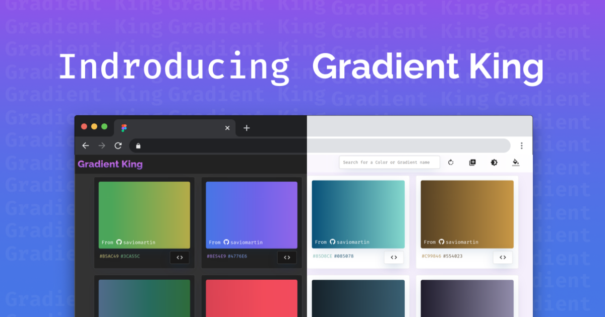

<p align="center">
  <a href="https://saviomartin.github.io/gh-profile-readme-generator">
    
  </a>
</p>
<h4 align="center">Never again run out of Gradients✨️</h4>

<p align="center">
<a href="https://github.com/saviomartin/gradientking/blob/master/LICENSE" target="blank">

</a>
<a href="https://github.com/saviomartin/gradientking/fork" target="blank">

</a>
<a href="https://github.com/saviomartin/gradientking/stargazers" target="blank">

</a>
<a href="https://github.com/saviomartin/gradientking/issues" target="blank">

</a>
<a href="https://github.com/saviomartin/gradientking/pulls" target="blank">

</a>

</p>

<p align="center"></p>

<p align="center">
    <a href="https://saviomartin.github.io/gh-profile-readme-generator" target="blank">View Demo</a>
    ·
    <a href="https://github.com/saviomartin/gradientking/issues/new/choose">Report Bug</a>
    ·
    <a href="https://github.com/saviomartin/gradientking/issues/new/choose">Request Feature</a>
</p>

### Fed up with searching gradients for your app?

Gradient king can help you. We provide a huge collection of gradients and you could easily choose one. Besides that, we also provides a gradient generator where you could upload your image and grad the gradients from it. How cool is that 🙌

## 🚀 Demo

<a href="https://saviomartin.github.io/gh-profile-readme-generator" target="blank">

</a>

Try the tool: [Gradient King](https://saviomartin.github.io/gradientking)

## 🧐 Features

Provides you a huge collection of awesome, elegant gradients. You can use it absolutely for free without attribution.

> Also provides a gradient generator which would help you generate gradients from your local image.

- **100+ gradients**
- **Generate your own gradients**
- **Copy CSS code of gradients**
- **Check for browser support**
- **Contributor page, and see your name on the main page and all other pages**[ >>Contributing](#-contributing)
- **Elegant animations**
- **PWA, Installable app**
- **Dark mode**
- **Minimal UI, Efficient work**
- **Fully Responsive**

Gradient King is super productive enough to grad the best gradients for your next app. ✨️

## 🛠️ Installation Steps

1. Clone the repository

```bash
git clone https://github.com/saviomartin/gradientking.git
```

2. Change the working directory

```bash
cd gradientking
```

3. Install dependencies

```bash
npm install
```

4. Run the app

```bash
npm start
```

🌟 You are all set!

## 🍰 Contributing

Head over to [public/data.json](public/data.json) and add your gradient at the bottom of the list. Here is an example contribution 👇

> Make sure that you have all the required items

```json
{
  "id": 104,
  "githubUsername": "saviomatin",
  "colors": [
    "#3CA55C",
    "#B5AC49"
  ]
},
```

Please contribute using [GitHub Flow](https://guides.github.com/introduction/flow). Create a branch, add commits, and [open a pull request](https://github.com/saviomartin/gradientking/compare).

Please read [`CONTRIBUTING`](CONTRIBUTING.md) for details on our [`CODE OF CONDUCT`](CODE_OF_CONDUCT.md), and the process for submitting pull requests to us.

## 💻 Built with

- [React](https://reactjs.org/)
- [Material UI](http://material-ui.com/): for styling and Icons
- [Animate.css](https://animate.style/): for smooth Animations
- [AOS](https://michalsnik.github.io/aos/): for scroll animations
- [react-router-dom](https://reactrouter.com/web/guides/quick-start): for routing
- [AWS Amplify](https://aws.amazon.com/amplify/): for hosting

## 🛡️ License

This project is licensed under the MIT License - see the [`LICENSE`](LICENSE) file for details.

## Deploy 🚀

<a href="https://console.aws.amazon.com/amplify/home#/deploy?repo=https://github.com/saviomartin/gradientking"></a>

## 🙏 Support

#### This project needs a 🌟 from you

<hr>
<p align="center">
Developed with ❤️ in India 🇮🇳 
</p>
